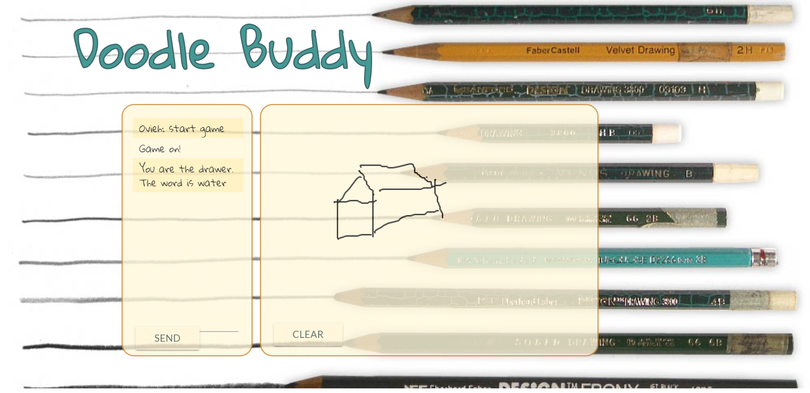

# Doodle Buddy

---

Doodle Buddy is a game where a player is prompted with a game word in which the player attempts to draw. The other players in the room attempt to guess the object being drawn. This app utilizes Websockets via Socket.io, uses a MySQL as a database, is rendered using Handlebars, and is served by Express.

---

## Installation

TODO: Describe the installation process

## Contributing

1.Fork it!
2.Create your feature branch: `git checkout -b my-new-feature`
3.Commit your changes: `git commit -am 'Add some feature'`
4.Push to the branch: `git push origin my-new-feature`
5.Submit a pull request :D

## Technologies Used

[Socket.io](https://socket.io/)

[Node.js](https://nodejs.org/en/)

[Express](https://expressjs.com/)

[JawsDB](https://www.jawsdb.com/)

[Handlebars.js](http://handlebarsjs.com/)

[Materialize](http://materializecss.com/)

## Authors

[Sara Javed](https://github.com/SJaved0327)

[Ovieh Mosley](https://github.com/ovieh)

[Daniel Perez](https://github.com/perez6736)

## History

TODO: Write history

## Credits

TODO: Write credits

## License

TODO: Write license
